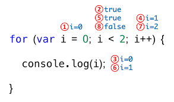
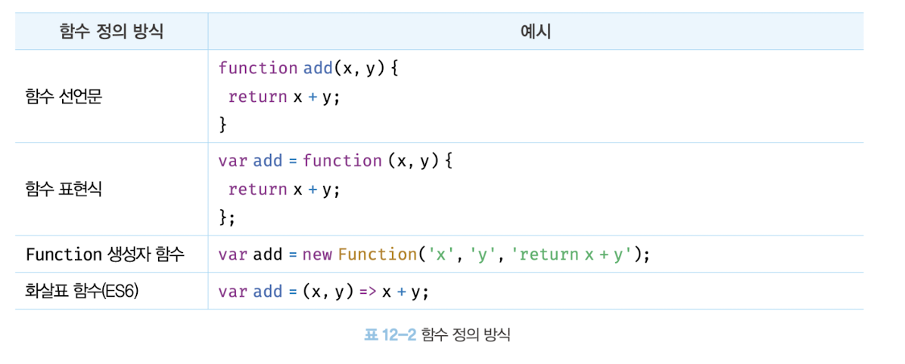

## 2 주차 질문

자바스크립트가 매개변수의 개수와 인수의 개수가 일치하는지 체크하지 않는 이유 (CH12)

---

# CH08 제어문

---

### 블록문

0개 이상의 문을 중괄호로 묶은 것 : 하나의 실행단위 <br>
(코드 블록 or 블록)

### 조건문

주어진 조건식의 평과 결과에 따라 코드 블록의 실행을 결정 <br>
(boolean 값으로 평가 가능)

#### if else문

주어진 조건식의 평가 결과, 논리적 참 또는 거짓에 따라 실행할 코드 블록을 결정

**if문의 조건식이 boolean 값이 아닌 값으로 평가되면 자바스크립트 엔진에 의해 암묵적으로 boolean값으로 강제 변환**

- else if 와 else 문은 옵션
- if 문과 else 문은 두 번 이상 사용불가, else if 문은 여러번 사용 가능
- 블록내 문이 하나라면 중괄호 생략 가능

```javascript
// if else 문
let x = 2;
let result;

if (x % 2) {
  result = '홀수';
} else {
  result = '짝수';
}
// 삼항 연산자
let result = x % 2 ? '홀수' : '짝수';
```

#### switch 문

주어진 표현식을 평가하여 그 값과 일치하는 표현식을 갖는 case 문으로 실행 흐름을 옮김

표현식과 일치하는 case 문이 없다면 실행 순서는 default 문으로 이동

문자열이나 숫자 값으로 평가

### 반복문

조건의 평가 결과가 참인 경우 코드 블록을 실행 (조건문이 거짓일 때 까지)

#### for 문

for 문은 조건식이 거짓으로 평가될 때까지 코드 블록을 반복 실행함

```javascript
for (변수 선언문 또는 할당문; 조건식; 증감식){
  조건식이 참인 경우 반복 실행될 문;
}
```

<p align="center">


**중첩 for문** : for 문 내에 for문을 중첩해 사용

#### while 문

주어진 조건식의 평가 결과가 참이면 코드 블록을 계속해서 반복 실행

거짓이 되면 코드블록을 실행하지 않고 종료

평가 결과가 불리언 값이 아니면 불리언 값으로 강제 변환

#### do while 문

코드 블록을 무조건 한 번 이상 실행하고 조건식 평가

#### break 문

레이블 문, 반복문, switch 문의 코드 블록 외에 break 문을 사용하면 문법 에러 발생

#### continue 문

반복문의 코드 블록 실행을 현 지점에서 중단하고 반복문의 증감식으로 실행 흐름 이동

# CH09 타입 변환과 단축 평가

---

#### 명시적 타입 변환 (타입 캐스팅)

개발자가 의도적으로 값의 타입을 변환하는 것

#### 암묵적 타입 변화 (타입 강제 변환)

개발자의 의도와 상관없이 표현식을 평가하는 도중에 자바스크립트 엔진에 의해 암묵적으로 타입 변환

> 타입 변환이란 기존 원시 값을 사용해 다른 타입의 새로운 원시 값 생성하는 것

### 암묵적 타입 변환

#### - 문자열 타입으로 변환

```javascript
1 + '2' => 12
'1 + 1' = ${1 +  1} => 1 + 1 = 2
```

#### - 숫자 타입으로 변환

```javascript
1 - '1' => 0
1 * '10' => 10
```

#### - 불리언 타입

조건식의 평가 결과를 불리언 타입으로 암묵적 타입 변환하여 불리언 타입이 아닌 값을 Truthy 값 또는 Falsy 값으로 구분함

**false로 평가되는 falsy 값**

- false
- undefined
- null
- 0, -0
- NaN
- ' '

### 명시적 타입 변환

#### - 문자열 타입으로 변환

- String 생성자 함수를 new 연산자 없이 호출
- Object.prototype.toString 메서드 사용
- 문자열 연결 연산자 이용

#### - 숫자 타입으로 변환

- Number 생성자 함수를 new 연산자 없이 호출
- parseInt, parseFloat 함수 사용 (문자열 -> 숫자)
- - 단항 산술 연산자 이용
- - 산술 연산자 이용

#### - 불리언 타입으로 변환

- Boolean 생성자 함수를 new 연산자 없이 호출
- ! 부정 논리 연산자 두 번 사용

### 단축평가

논리 연산의 결과를 결정하는 피연산자를 타입 변환하지 않고 그대로 반환

표현식을 평가하는 도중에 평가 결과가 확정된 경우 나머지 평가 과정 생략

### 논리 연산자를 사용한 단축 평가

```javascript
'Cat' && 'Dog'; // -> 'Dog'
```

논리곱 연산자는 논리 연산의 결과를 결정하는 두 번째 피연산자, 즉 위 예제에서 'Dog'를 반환함

```javascript
'Cat' || 'Dog'; // -> 'Cat'
```

논리합 연산자는 논리 연산의 결과를 결정한 첫 번째 피연산자,
즉 위 예제에서 'Cat'을 그대로 반환함

#### 단축평가로 if문 대체

조건이 Truthy 값일 때 논리합 연산자(&&) 사용

조건이 Falsy 값일 때 논리 곱 연산자(||) 사용

### 단축 평가의 사용

- 객체를 가리키기를 기대하는 변수가 null 또는 undefined가 아닌지 확인하고 프로퍼티를 참조할 때

- 함수 매개변수에 기본값을 설정할 때

#### 옵셔널 체이닝 연산자 ?.

좌항의 피연산자가 null 또는 undefined인 경우 undefined를 반환하고, 그렇지 않으면 우항의 프로퍼티 참조를 이어감

#### null 병합 연산자 ??

좌항의 피연산자가 null 또는 undefined인 경우 우항의 피연산자를 반환하고 그렇지 않으면 좌항의 피연산자를 반환함

변수의 기본값을 설정할 때 유용

# CH10 객체 리터럴

---

### 객체

다양한 타입의 값을 하나의 단위로 구성한 복합 자료구조

객체는 변경 가능한 값

0개 이상의 프로퍼티로 구성된 집합이며 **프로퍼티**는 키와 값으로 구성

**프로퍼티** : 객체의 상태를 나타내는 값
**메서드** : 프로퍼티를 참조하고 조작할 수 있는 동작

### 객체 생성 방법

- 객체 리터럴
- Object 생성자 함수
- 생성자 함수
- Object.create 메서드
- 클래스

#### 객체 리터럴 생성 방법

중괄호 내에 0개 이상의 프로퍼티 정의

객체 리터럴의 중괄호는 코드 블록을 의미하지 않음

객체 리터럴의 닫는 중괄호 뒤에는 세미콜론을 붙임

> 객체 리터럴에 프로퍼티를 포함시켜 객체를 생성함과 동시에 프로퍼티를 만들 수도 있고, 객체를 생성한 이후에 프로퍼티를 동적으로 생성할 수도 있다.

### 프로퍼티

프로퍼티를 나열할 때는 쉼표(,)로 구분

프로퍼티 키 : 빈 문자열을 포함하는 모든 문자열 또는 심벌 값
프로퍼티 값 : 자바스크립트에서 사용할 수 있는 모든 값

**식별자 네이밍 규칙을 따르지 않는 이름에는 반드시 따옴표 사용**

#### 프로퍼티 키 동적 생성

문자열 또는 문자열로 평가할 수 있는 표현식을 사용할 때 표현식을 대괄호 []로 묶음

프로퍼티 키에 문자열이나 심벌 값 외의 값을 사용하면 암묵적 타입 변환을 통해 문자열로 변환

이미 존재하는 프로퍼티 키를 중복 선언하면 나중에 선언한 프로퍼티가 먼저 선언한 프로퍼티를 덮어씀

### 메서드

프로퍼티 값이 함수일 경우

#### 프로퍼티 접근 방법

- 마침표 프로퍼티 접근 연산자(.)를 사용하는 마침표 표기법
- 대괄호 프로퍼티 접근 연산자[]를 사용하는 대괄호 표기법
  - 대괄호 프로퍼티 접근 연산자 내부에 지정하는 프로퍼티 키는 반드시 따옴표로 감싼 문자열이어야 함

**객체에 존재하지 않는 프로퍼티에 접근하면 undefined를 반환한다**

#### 프로퍼티 값 갱신

이미 존재하는 프로퍼티에 값을 할당하면 프로퍼티 값이 갱신됨

#### 프로퍼티 동적 생성

존재하지 않는 프로퍼티에 값을 할당하면 프로퍼티가 동적으로 생성되어 추가되고 프로퍼티 값이 할당됨

#### 프로퍼티 삭제

delete 연산자를 사용해 프로퍼티를 삭제

존재하지 않는 프로퍼티 삭제 시 에러없이 무시 됨

### ES6에서 추가된 객체 리터럴 확장기능

#### 프로퍼티 축약표현

프로퍼티 값으로 변수를 사용하는 경우 변수 이름과 프로퍼티 키가 동일한 이름일 때 프로퍼티 키를 생략 가능

이떄 프로퍼티 키는 변수 이름으로 자동생성 됨

#### 계산된 프로퍼티 이름

문자열 또는 문자열로 타입 변환할 수 있는 값으로 평가되는 표현식을 사용해 프로퍼티 키 동적 생성 시 표현식을 대괄호로 묶어야 함

#### 메서드 축약 표현

메서드를 정의할 때 function 키워드를 생략한 축약 표현 사용 가능

# CH11 원시 값과 객체의 비교

---

#### 원시 값 : 변경 불가능한 값

#### 객체 값 : 변경 가능한 값

원시 값을 변수에 할당하면 변수에 실제 값이 저장됨

객체를 변수에 할당하면 변수에는 참조 값이 저장 됨

#### 원시 값의 불변성

불변성을 갖는 원시 값을 할당한 변수는 재할당 이외에 변수 값을 변경할 수 있는 방법이 없음

자바스크립트의 문자열 또한 원시 타입이며, 변경 불가능함

**문자열은 유사 배열 객체이면서 이터러블이므로 배열과 유사하게 각 문자에 접근할 수 있다.**

#### 유사 배열 객체

배열처럼 인덱스로 프로퍼티 값에 접근할 수 있고, length 프로퍼티를 갖는 객체를 말함

#### 값에 의한 전달

변수에 원시 값을 갖는 변수를 할당하면 할당받는 변수에는 할당되는 변수의 원시 값이 복사되어 전달됨

값에 의한 전달 = 메모리 주소 전달

> 두 변수의 원시 값은 서로 다른 메모리 공간에 저장된 별개의 값이 되어 어느 한 쪽에서 재할당을 통해 값을 변경하더라도 서로 간섭할 수 없음

### 객체

객체는 복합적인 자료구조이므로 객체를 관리하는 방식이 원시 값과 비교해서 복잡하고 메모리 용량이 커질 수 있음

객체는 변경 가능한 값이므로 재할당 없이 객체를 직접 변경 가능

즉, 재할당 없이 프로퍼티를 동적으로 추가할 수도 있고 프로퍼티 값을 갱신할 수도 있으며 프로퍼티 자체를 삭제할 수 있음

#### 객체와 원시 값의 차이점

여러 개의 식별자가 하나의 객체를 공유할 수 있음

#### 얕은 복사와 깊은 복사

얕은 복사 : 한 단계까지만 복사

깊은 복사 : 객체에 중첩되어 있는 객체까지 모두 복사

얕은 복사는 객체에 중첩되어 있는 객체의 경우 참조 값을 복사하고 깊은 복사는 객체에 중첩되어 있는 객체까지 모두 복사해서 원시 값처럼 완전한 복사본을 만듦

#### 참조에 의한 전달

두 개의 식별자가 하나의 객체를 공유

> 자바스크립트에는 "참조에 의한 전달"은 존재하지 않고 "값에 의한 전달"만 존재

변수에 저장되어 있는 값이 원시 값이냐 참조 값이냐의 차이만 있기 때문

# CH12 함수

---

### 함수

일련의 과정을 문으로 구현하고 코드 블록으로 감싸서 하나의 실행 단위로 정의한 것

함수는 객체이다.

#### 함수 호출

인수를 매개변수를 통해 함수에 전달하면서 함수의 실행을 명시적으로 지시

#### 함수를 사용하는 이유

- 코드의 재사용
- 유지보수의 편의성
- 코드의 신뢰성 / 가독성

#### 함수 리터럴

함수 리터럴은 function 키워드, 함수 이름, 매개변수 목록, 함수 몸체로 구성

<p align="center">


#### 함수와 일반 객체의 차이점

일반 객체는 호출할 수 없지만 함수는 호출 가능

#### 함수 정의

함수를 호출하기 이전에 인수를 전달받을 매개변수와 실행할 문들, 반환할 값을 저장하는 것

### 함수 정의 방식



#### 함수 선언문으로 정의

함수 리터럴과 형태가 동일하나 함수 이름 생략 불가능

함수 선언문은 표현식이 아닌 문이므로 변수에 할당할 수 없음

이름이 있는 기명 함수 리터럴은 코드의 문맥에 따라 함수 선언문 또는 함수 리터럴 표현식으로 해석됨

**자바스크립트 엔진은 생성된 함수를 호출하기 위해 함수 이름과 동일한 이름의 식별자를 암묵적으로 생성하고, 거기에 함수 객체 할당**

함수는 함수 이름으로 호출하는 것이 아니라 함수 객체를 가리키는 식별자로 호출

#### 함수 표현식으로 정의

함수는 값의 성질을 갖는 일급 객체임

**함수 리터럴의 함수 이름은 생략 가능 : 익명 함수**

### 함수 생성 시점과 함수 호이스팅

#### 함수 호이스팅

함수 선언문이 코드의 선두로 끌어 올려진 것처럼 동작하는 자바스크립트 고유의 특징

함수 선언문을 통해 암묵적으로 생성된 식별자는 함수 객체로 초기화 됨

**함수 표현식으로 함수를 정의하면 함수 호이스팅이 발생하는 것이 아니라 변수 호이스팅이 발생함**

#### Function 생성자 함수

생성자 함수에 매개변수 목록과 함수 몸체를 문자열로 전달하면서 new 연산자와 함께 호출하면 함수 객체를 생성해서 반환

#### 화살표 함수

function 키워드 대신 화살표를 사용해 간략한 방법으로 함수 선언

항상 익명 함수로 정의

#### 화살표 함수의 특징

- 생성자 함수로 사용 불가
- 기존 함수와 this 바인딩 방식이 다름
- prototype 프로퍼티가 없음
- arguments 객체를 생성하지 않음

### 함수 호출

식별자와 한 쌍의 소괄호인 함수 호출 연산자로 호출

#### 매개변수와 인수

함수를 실행하기 위해 필요한 값을 함수 외부에서 함수 내부로 전달할 필요가 있는 경우, 매개변수를 통해 인수 전달

#### 인수

- 값으로 평가될 수 있는 표현식
- 함수를 호출할 때 지정하며, 개수와 타입에 제한이 없음

#### 매개변수

- 함수 몸체 내부에서 변수와 동일하게 취급함\*\*
- 함수 몸체 내부에서만 참조 가능

자바스크립트는 매개변수의 개수와 인수의 개수가 일치하는지 체크하지 않음

인수가 부족해서 인수가 할당되지 않은 매개변수의 값은 undefined

매개변수보다 인수가 더 많은 경우 초과된 인수는 무시 됨 -> arguments 객체의 프로퍼티로 보관

#### 매개변수의 최대 개수

명시적으로 제한하고 있지는 않으나 물리적 한계 존재

> 이상적인 함수는 한 가지 일만 해야하며 가급적 작게 만들어야 함

### 반환문

함수는 return 키워드와 표현식으로 이뤄진 반환문을 사용해 실행 결과를 함수 외부로 반환 할 수 있음

#### 반환문의 역할

- 함수의 실행을 중단하고 함수 몸체를 빠져나감
- return 키워드 뒤에 오는 표현식을 평가해 반환 / 지정하지 않으면 undefined 반환
- 반환문은 생략 가능
- 함수 몸체 내부에서만 사용 가능

#### 참조에 의한 전달과 외부 상태의 변경

함수 몸체에서 참조 값을 통해 객체를 변경할 경우 원본이 훼손됨 -> 상태변화를 추적하기 어려워짐 -> 코드 복잡성 증가 및 가독성 저하

#### 해결 방법

객체를 불변 객체로 만들어 사용

객체의 깊은 복사를 통해 새로운 객체를 생성하고 재할당을 통해 교체

### 함수의 형태

- #### 즉시 실행 함수

  - 정의와 동시에 실행
  - 한 번만 호출
  - 익명 함수 사용이 일반적
  - 그룹 연산자로 감싸야 함

- #### 재귀 함수

  - 함수가 자기 자신을 호출
  - 무한 반복에 빠질 위험성

- #### 중첩 함수

  - 함수 내부에 정의된 함수
  - 함수 내부에서만 호출 가능

- #### 콜백 함수

  - 함수의 매개변수를 통해 다른 함수의 내부로 전달되는 함수
  - 고차 함수에 의해 호출

- #### 고차 함수

  - 매개 변수를 통해 함수의 외부에서 콜백 함수를 전달받은 함수
  - 콜백 함수를 자신의 일부분으로 합성
  - 매개 변수를 통해 전달받은 콜백 함수의 호출 시점을 결정해서 호출

- #### 순수 함수

  - 외부 상태에 의존하지 않고 변경되지 않는, 부수효과가 없는 함수
  - 동일 인수가 전달되면 동일한 값 반환
  - 하나 이상의 인수를 전달 받음

- #### 비순수 함수
  - 외부 상태에 의존하거나 상태가 변경되는, 부수효과가 있는 함수
  - 외부 상태에 따라 반환 값이 달라짐

# CH13 스코프

---

### 스코프(유효범위) : 식별자가 유효한 범위 || 식별자를 검색할 때 사용되는 규칙

모든 식별자는 자신이 선언된 위치에 의해 다른 코드가 식별자 자신을 참조할 수 있는 유효범위가 결정됨

```javascript
var x = 'global';

function foo() {
  var x = 'local';
  console.log(x); // 1. local
}

foo();

console.log(x); // 2. global
```

위 예시에서 자바스크립트 엔진은 이름이 같은 두 개의 변수 중에서 어떤 변수를 참조해야 할 것인지를 결정해야 한다. 이를 **식별자 결정** 이라고 함

#### 렉시컬 환경

코드가 어디서 실행되며 주변에 어떤 코드가 있는지 확인하기 위해 실행할 스코프 범위 안에 있는 변수와 함수를 프로퍼티로 저장하는 객체

> 스코프 내에서 식별자는 유일해야 하지만 다른 스코프에는 같은 이름의 변수를 사용할 수 있다.

#### 스코프의 종류

- 전역 스코프 : 코드의 가장 바깥 영역에 위치하며 전역에서 선언된 변수는 전역 스코프를 갖는다. <br> 어디서든 참조 가능

- 지역 스코프 : 함수 몸체 내부에서 선언되며 지역에서 선언된 변수는 지역 스코프를 갖는다.<br> 자신의 지역 스코프와 하위 지역 스코프에서 유효함

#### 스코프 체인

스코프가 계층적 구조로 연결된 것

변수를 참조할 때 자바스크립트 엔진은 스코프 체인을 통해 변수를 참조하는 코드의 스코프에서 시작하여 상위 스코프 방향으로 이동하며 선언된 변수를 검색한다. 따라서 상위 스코프에서 선언한 변수를 하위 스코프에서도 참조할 수 있다.

> 상위 스코프에서 유효한 변수는 하위 스코프에서 자유롭게 참조할 수 있지만 하위 스코프에서 유효한 변수를 상위 스코프에서 참조할 수 없다.

#### 함수 레벨 스코프

var 키워드로 선언된 변수는 함수의 코드 블록 만을 지역 스코프로 인정

#### 블록 레벨 스코프

const, let으로 선언된 변수는 모든 코드 블록 내부의 지역 스코프 생성

#### 렉시컬 스코프

함수를 어디서 정의했는지에 따라 상위 스코프 결정 (호출 위치 x)

```javascript
let i = 10; // 전역 스코프

function foo() {
  let i = 100; // (함수 레벨 스코프)

  for (let i = 1; i < 3; i++) {
    console.log(i); // 1 2 (블록 레벨 스코프)
  }
  console.log(i); // 100
}
foo();

console.log(i); // 10
```

# CH14 전역 변수의 문제점

---

#### 지역 변수의 생명 주기

지역 변수의 생명주기는 함수의 생명 주기와 일치

#### 호이스팅

변수 선언이 스코프의 선두로 끌어 올려진 것처럼 동작하는 자바스크립트 고유의 특징

#### 전역 변수의 생명 주기

코드가 로드되자마자 곧바로 해석되고 실행 -> 더 이상 실행할 문이 없을 때 종료

전역 객체의 생명주기와 일치

#### 전역 변수

코드가 실행되기 이전 단계에 자바스크립트 엔진에 의해 어떤 객체보다도 먼저 생성되는 특수한 객체

전역 객체는 표준 빌트인 객체, 환경에 따른 호스트 객체, var 키워드로 선언한 전역 변수와 전역 함수를 프로퍼티로 가짐

### 전역 변수의 문제점

- 암묵적 결합
- 긴 생명 주기
- 스코프 체인 상에서 종점에 존재
- 네임스페이스 오염

### 전역 변수 사용 억제 방법

전역 변수를 반드시 사용해야 할 이유를 찾지 못한다면 지역 변수 사용 <br>
변수의 스코프는 좁을 수록 좋음

- 즉시 실행 함수
- 네임스페이스 객체
- 모듈 패턴
- ES6 모듈
